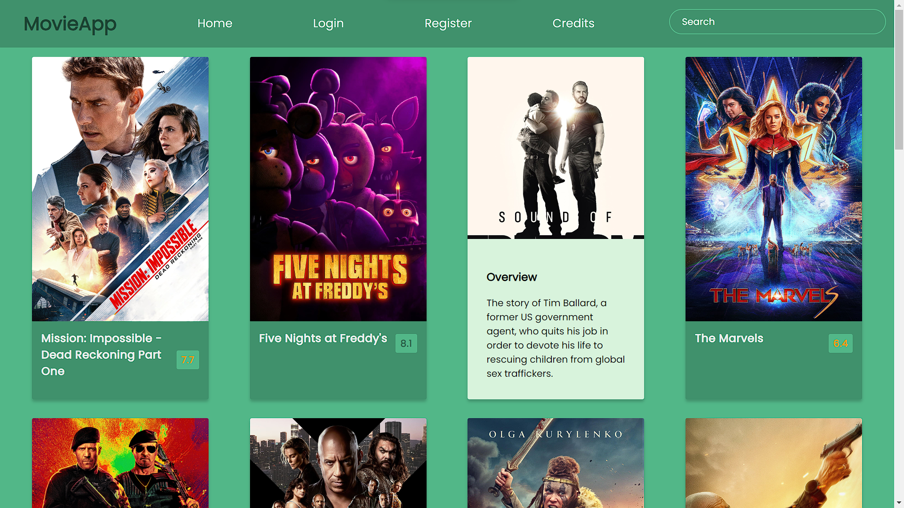

# My Portfolio

Welcome to my portfolio! This web page showcases my skills, experiences, and projects. Whether you're a potential employer, collaborator, or simply curious about my work, you've come to the right place.

## Table of Contents

1. [About Me](#about-me)
2. [Experience](#experience)
3. [Projects](#projects)
4. [Contact Me](#contact-me)
5. [Footer](#footer)

---

## About Me

Hello, I'm **Ujjwal Prajapati**, a **Frontend Developer**. I'm enthusiastic about technology and constantly exploring the ever-evolving world of web development.

- **Email:** [ujjwalprajapati154@gmail.com](mailto:ujjwalprajapati154@gmail.com)
- **LinkedIn:** [LinkedIn Profile](www.linkedin.com/in/ujjwal-prajapati-7508b7265)
- **GitHub:** [GitHub Profile](https://github.com/)

Download my [CV](./assets/resume-example.pdf) for more details.

## Experience

### Frontend Development

I have **1+ years** of experience in frontend development, with expertise in the following technologies:

- HTML (Experienced)
- CSS (Experienced)
- Bootstrap (Intermediate)
- JavaScript (Basic)
- React (Basic)
- Figma (Intermediate)

### Backend Development

In addition to frontend development, I also have some experience in backend development:

- MySQL (Basic)
- Node.js (Intermediate)
- Java (Experienced)
- Python (Intermediate)
- C++ (Intermediate)
- Git (Intermediate)

## Projects

### MovieApp

- **Description:** A Movie App that displays the latest movies with their ratings and overviews.
- **Technologies Used:** React, Tailwind CSS
- [GitHub Repository](https://github.com/Ujjwalprajapati16/MovieApp/tree/main/my-app)
- [Live Demo](https://github.com/Ujjwalprajapati16/MovieApp/tree/main/my-app)

### Amazon Website Clone

- **Description:** A clone of the Amazon website.
- **Technologies Used:** HTML5, CSS, JavaScript
- [GitHub Repository](https://github.com/Ujjwalprajapati16/amazon.github.io)
- [Live Demo](https://ujjwalprajapati16.github.io/amazon.github.io/)

### 2048 Game

- **Description:** A simple implementation of the popular 2048 game.
- **Technologies Used:** Python
- [GitHub Repository](https://github.com/Ujjwalprajapati16/2048)
- Live Demo: Not available

## Contact Me

If you'd like to get in touch, you can reach me through the following channels:

- **Email:** [ujjwalprajapati154@gmail.com](mailto:ujjwalprajapati154@gmail.com)
- **LinkedIn:** [LinkedIn Profile](www.linkedin.com/in/ujjwal-prajapati-7508b7265)

Feel free to connect with me for collaboration opportunities, questions, or just a friendly chat about technology and development!

## Footer

© 2023 Ujjwal Prajapati. All Rights Reserved.
